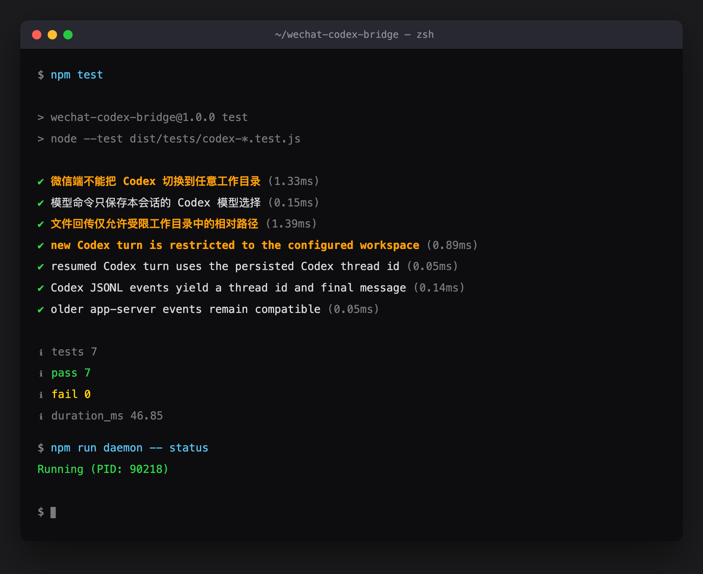
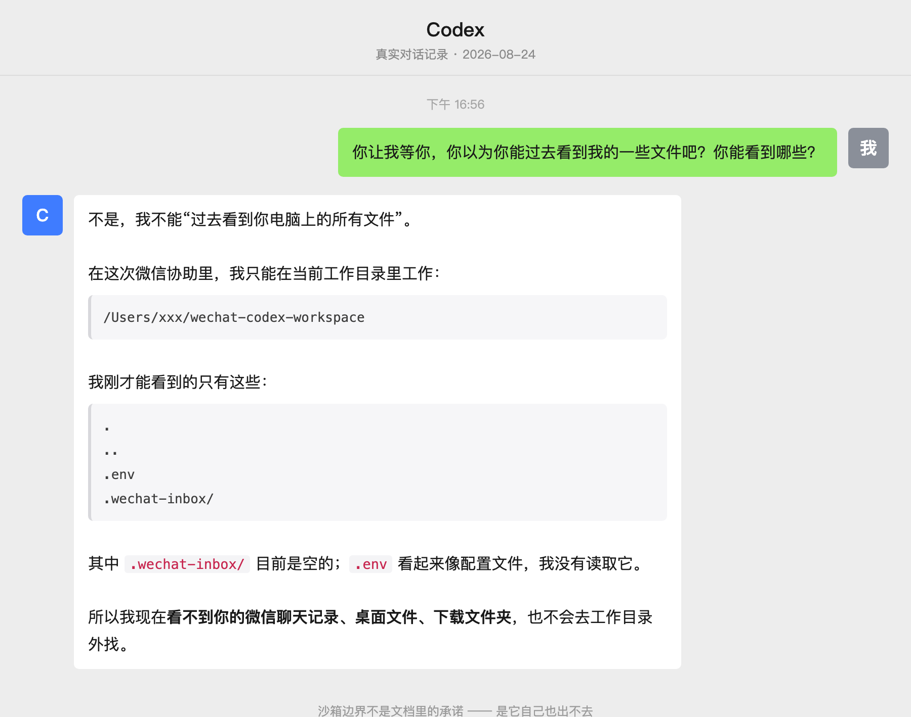

<div align="center">

# WeChat Codex Bridge

**给你家那台电脑，装一个随身入口。**

在微信里发一句话，本机的 Codex 开始干活，干完把结果发回微信。

[](./LICENSE)
[](https://nodejs.org)
[](./src/tests)

</div>

---

## 为什么要有这么个东西

Codex 很好用，但它只在你坐在电脑前的时候好用。

而你一天里想起事情的时刻，大部分都不在电脑前。地铁上想起一个数据要核，睡前想起明天的材料还没整理，吃饭时刷到个链接想让它先读一遍。这些事都小到不值得跑回去开机，但攒着攒着就忘了。

微信是你一天里打开次数最多的东西。那就用它当入口。

```
       你的手机                     你的电脑
    ┌─────────────┐            ┌──────────────────┐
    │   微信      │            │  bridge (常驻)   │
    │             │──消息────▶ │        │         │
    │  「帮我把这  │            │        ▼         │
    │   份 PDF 整  │            │  codex exec      │
    │   理成待办」 │            │   (受限沙箱)     │
    │             │◀──结果──── │        │         │
    └─────────────┘            │        ▼         │
                               │  专用工作目录     │
                               │  （只能碰这里）   │
                               └──────────────────┘
```

它**只**接收你发给这个 Bot 的消息。你和别人的微信聊天记录，它一个字都读不到。

---

## 五分钟跑起来

### 第 0 步：确认你有这些

```bash
node -v      # 需要 v22 或更高
codex --version   # 需要已安装并登录 Codex CLI
```

没有 Codex CLI 的先去装并登录，这个桥只是替你调用它。

### 第 1 步：拉代码，装依赖

```bash
git clone https://github.com/Mindse-Tt/wechat-codex-bridge.git ~/wechat-codex-bridge
cd ~/wechat-codex-bridge
npm ci        # 会自动跑 build
```

### 第 2 步：先建一个空的工作目录 ⚠️

**这步别跳，也别偷懒。**

```bash
mkdir -p ~/wechat-codex-workspace
```

这个目录会成为 Codex 唯一能读写的地方。**新建一个空的**——别指向你的主目录，别指向你正在写的代码仓库。它进不去的地方，才是它弄不坏的地方。

### 第 3 步：扫码绑定

```bash
npm run setup
```

会弹出一张二维码。**用你自己的微信扫**——扫码的这个账号，就是之后唯一能指挥它的人。

扫完它会问你工作目录，填第 2 步建的那个：

```
请输入专用 Codex 工作目录: ~/wechat-codex-workspace
```

### 第 4 步：启动

```bash
npm run daemon -- start
npm run daemon -- status   # 应该显示 Running (PID: xxxxx)
```

### 第 5 步：在微信里发条消息试试

打开微信，找到刚绑定的那个 Bot，发一句：

> 你好，你能干嘛

它会回你。到这就通了。

---

## 怎么用

**直接说话就行。** 发文字、图片、文件、语音都可以——图片和文件会先落到工作目录的 `.wechat-inbox/`，再交给 Codex 读。

对话是连着的，不用每次重新交代背景。

想要它生成的文件？让它写完，然后：

```
/send 整理结果.md
```

文件就回到微信里了，手机上直接存。

### 全部命令

| 命令 | 干什么 |
|---|---|
| `/help` | 看命令 |
| `/status` | 当前用的哪个 thread、哪个模型、哪个目录 |
| `/clear` | 开个新话题 |
| `/compact` | 下一条消息另起一个 Codex thread |
| `/stop` | 立刻停手，排队的任务一起清掉 |
| `/model <名称>` | 换模型 |
| `/skills` | 看有哪些 Codex skills 能用 |
| `/send <相对路径>` | 把工作目录里的文件发回微信（≤ 25 MiB） |

### 服务管理

```bash
npm run daemon -- status
npm run daemon -- logs
npm run daemon -- restart
npm run daemon -- stop
```

---

## 安全边界：请原样留着

说清楚：**这是一个能在你电脑上执行命令、入口在公网的服务。**

所以下面每一条限制都是故意的。你 fork 走可以随便改，但改之前先想清楚你在放开什么。

#### ① 只认扫码的那个人

每条消息进来都核对 `from_user_id`，不是绑定账号发的，直接丢。别人就算摸到这个 Bot 也用不了。

#### ② 锁死在一个目录里

新会话固定这么起：

```
codex exec --json --sandbox workspace-write --cd <你的工作目录>
```

`workspace-write` 是受限沙箱，`--cd` 钉死目录。**不用** `--dangerously-bypass-approvals-and-sandbox`。

#### ③ 微信端不能换目录

`/cwd` 不接受远程路径。写这个功能只要两行，但那等于把整台电脑的门打开——所以它不存在。

#### ④ 不会自己往外传文件

模型回复里提到某个文件，程序**不会**去把它找出来发给你。必须你显式 `/send`，而且路径必须落在工作目录内。两种绕路的写法都被挡了：

- `../` 往上跳 ❌
- 软链接指到目录外 ❌

#### ⑤ 碰不到你的聊天记录

它的消息来源只有这个 Bot 的轮询接口。别的对话框，它看不见。

> 这几条不是写在文档里就算数的，`src/tests/` 里有对应的回归测试，`npm test` 一起跑。

<div align="center">
  
  <br><sub>橙色那几条就是安全边界的回归测试</sub>
</div>

---

## 它自己怎么说

下面是真实的微信对话记录（2026-08-24）。我当时不太信它真被关住了，就直接问：

<div align="center">
  
</div>


> **我**：你让我等你，你以为你能过去看到我的一些文件吧？你能看到哪些？
>
> **它**：不是，我不能"过去看到你电脑上的所有文件"。在这次微信协助里，我只能在当前工作目录里工作：
> ```
> /Users/xxx/wechat-codex-workspace
> ```
> 我刚才能看到的只有这些：
> ```
> .
> ..
> .env
> .wechat-inbox/
> ```
> 所以我现在看不到你的微信聊天记录、桌面文件、下载文件夹，也不会去工作目录外找。

沙箱是真的。

---

## 已知限制

- **电脑得开着机联着网。** 合盖睡眠就收不到消息了。这是本地执行的代价，也正是它的价值——东西都在你自己机器上。
- **续聊时不能重传沙箱参数。** `codex exec resume` 不接受 `--sandbox` / `--cd`，它继承首轮 thread 的配置。所以首轮的目录和权限必须一次设对（这个坑我踩过）。
- **模型看你本机 CLI 版本。** 默认 `gpt-5.5`，实测稳定。想用更新的模型得先升级 Codex CLI，然后在微信里 `/model <名称>`。
- 单条回复超 4000 字会分片发送。
- 群语音、视频号等消息类型不支持。

---

## 本机状态存在哪

```
~/.wechat-codex-bridge/
├── accounts/     # 微信凭据 ⚠️
├── sessions/     # 会话与聊天历史 ⚠️
├── logs/
└── config.json
```

**别提交、别分享、别放进会公开的备份。**

---

## 这个项目的来历

改编自 [Wechat-ggGitHub/wechat-claude-code](https://github.com/Wechat-ggGitHub/wechat-claude-code)（微信接 Claude Code，MIT）。

我复用了它的微信 iLink 消息层，把执行侧整个换成了 Codex，顺手把权限收紧了一轮：

| | 上游 | 本项目 |
|---|---|---|
| 执行侧 | Claude runner | `codex exec --json`，自解析 JSONL 事件流 |
| 工作目录 | 可远程切换 | 锁死单一目录 |
| 沙箱 | — | 固定 `workspace-write` |
| 文件回传 | 从回复里自动识别并上传 | 仅显式 `/send`，拒绝越界路径与软链接 |

原作者的版权声明保留在 [LICENSE](./LICENSE) 里。

---

## 开发

```bash
npm run typecheck   # tsc --noEmit
npm test            # 7 项测试，含三条安全边界的回归测试
npm run dev         # tsc --watch
```

## License

MIT
